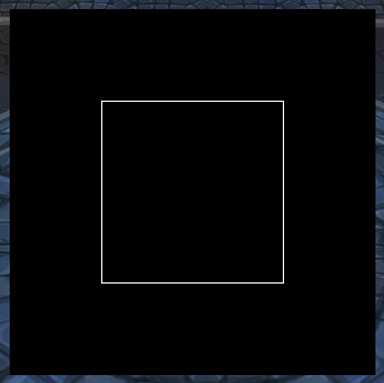

# LibPixelPerfect-1.0

WoW addon library to allow for pixel perfection by finding the right pixel sizes for your resolution. Very useful for textures, particularly small textures, to ensure consistent rendering and eliminate distortion.

Currently only supports clients with PixelUtil (Retail, Classic, Classic Era). Any "unofficial" flavors of the game may not work.

## Usage

Using this library is similar to other libraries that use LibStub.

### Embedding the Library

To use this library, embed it in your addon by adding the following to your `.pkgmeta` file (The `Libs/` paths are just examples):

```yml
externals:
  # your other externals...
  Libs/LibStub: https://repos.wowace.com/wow/ace3/trunk/LibStub
  Libs/LibPixelPerfect-1.0: https://github.com/McTalian/LibPixelPerfect-1.0/LibPixelPerfect-1.0

```

Then include it into either an XML file or your Toc file:

`embeds.xml` example (assuming it is next to the `Libs/` folder):
```xml
<Ui xsi:schemaLocation="http://www.blizzard.com/wow/ui/ ..\FrameXML\UI.xsd">
  <Script file="Libs\LibStub\LibStub.lua"/>
  <Include file="Libs\LibPixelPerfect-1.0\lib.xml"/>
</Ui>

```

`YourAddon.toc` example:
```
## Interface: 110200
## Title: Your Addon

# If you use embeds.xml
# embeds.xml

# Otherwise
Libs/LibStub/LibStub.lua
Libs/LibPixelPerfect-1.0/lib.xml

YourAddon.lua

```

### Using the Library

Once the library is embedded (or otherwise available to your addon), you can use it in your Lua code like the following example.

`YourAddon.lua` example:
```lua
local LPP = LibStub("LibPixelPerfect-1.0")

local frame = CreateFrame("Frame", nil, UIParent)
LPP.PSize(frame, 400, 400)
frame:SetPoint("CENTER")

local background = frame:CreateTexture(nil, "BACKGROUND")
background:SetAllPoints(frame)
background:SetColorTexture(0, 0, 0, 1)

local topBar = frame:CreateTexture(nil, "ARTWORK")
topBar:SetColorTexture(1, 1, 1, 1)
topBar:SetPoint("TOP", frame, "TOP", 0, LPP.PScale(-400/4))
LPP.PHeight(topBar, 1)
LPP.PWidth(topBar, 400/2)
local rightBar = frame:CreateTexture(nil, "ARTWORK")
rightBar:SetColorTexture(1, 1, 1, 1)
rightBar:SetPoint("RIGHT", frame, "RIGHT", LPP.PScale(-400/4), 0)
LPP.PWidth(rightBar, 1)
LPP.PHeight(rightBar, 400/2)
local bottomBar = frame:CreateTexture(nil, "ARTWORK")
bottomBar:SetColorTexture(1, 1, 1, 1)
bottomBar:SetPoint("BOTTOM", frame, "BOTTOM", 0, LPP.PScale(400/4))
LPP.PHeight(bottomBar, 1)
LPP.PWidth(bottomBar, 400/2)
local leftBar = frame:CreateTexture(nil, "ARTWORK")
leftBar:SetColorTexture(1, 1, 1, 1)
leftBar:SetPoint("LEFT", frame, "LEFT", LPP.PScale(400/4), 0)
LPP.PHeight(leftBar, 400/2)
LPP.PWidth(leftBar, 1)

frame:Show()

```


